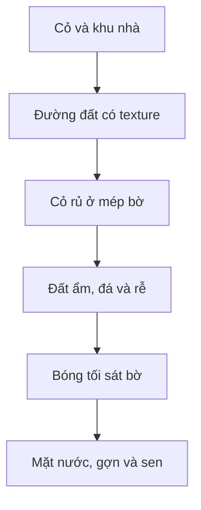

Với phong cách vẽ hiện tại, đường đi và bờ sông phải có chất **vẽ tay, nhiều mảng màu bất quy tắc**, không nên dùng nền màu phẳng, chấm tròn lặp lại hoặc đá hình bầu dục giống nhau.

## 1. Làm lại đường làng

Nên dùng một dải đường đất vàng nâu rộng khoảng **220–280 px**, chạy hơi uốn nhẹ theo `walkable polygon`.

Đường gồm ba lớp:

* Nền đất màu vàng nâu nhạt.
* Những mảng đất đậm, vết nứt và vệt bánh xe rất nhẹ.
* Cỏ mọc không đều ở hai mép.

Không rải chi tiết đều nhau. Nên để khoảng 70% mặt đường khá trống để nhân vật và con vật dễ nhìn.

Tránh:

* Chấm tròn xanh lặp theo lưới.
* Đường viền thẳng tuyệt đối.
* Hoa, đá và cỏ rải quá dày.
* Texture phóng quá lớn hoặc lặp dễ nhận ra.

## 2. Bờ sông không nên là một dải nâu thẳng

Hãy chia bờ thành ba lớp mỏng:

| Lớp                       | Chiều cao |
| ------------------------- | --------: |
| Cỏ phủ mép bờ             |  10–18 px |
| Đất nâu ẩm lộ ra          |  20–30 px |
| Đá, rễ và lau mọc rải rác |  10–20 px |

Mép bờ nên cong nhẹ và có chỗ:

* Cỏ rủ xuống nước.
* Đất bị khoét lõm.
* Một vài viên đá lớn xen đá nhỏ.
* Rễ cây hoặc bụi lau.
* Có đoạn hoàn toàn không có đá.

Không nên xếp đá thành hàng liên tục với cùng kích thước như hiện tại.

## 3. Mặt nước phải nối tự nhiên với bờ

Ngay sát bờ, nước nên có màu xanh đậm hơn. Ra xa bờ thì sáng hơn một chút:

* Thêm bóng phản chiếu tối dưới mép cỏ.
* Vẽ gợn nước ngang ngắn, không đều.
* Lá sen gần camera lớn hơn, lá ở sát bờ nhỏ hơn.
* Không rải lá sen theo khoảng cách đều nhau.
* Thuyền và vật nổi cần có bóng phản chiếu rất nhẹ.

## 4. Cấu trúc layer nên dùng

`Walkable polygon` chỉ dùng cho logic và chế độ debug. Không dùng đường nét polygon làm ranh giới hình ảnh thực tế.

## 5. Những asset nên vẽ riêng

Để ghép cảnh mà không bị lặp, nên chuẩn bị:

* 3 đoạn texture đường đất liền mạch.
* 4 đoạn mép cỏ khác nhau.
* 4 đoạn bờ đất–đá khác nhau.
* 6 cụm cỏ nhỏ.
* 4 cụm lau sậy.
* 8 viên đá với kích thước khác nhau.
* 5 mảng đất đậm hoặc vết nứt.
* 4 kiểu gợn nước.
* Lá sen, hoa sen và bèo tách riêng.

Các đoạn bờ có thể dài khoảng **256–512 px**, ghép xen kẽ và lật ngang để khó nhận ra sự lặp lại.

## 6. Cách sửa trực tiếp cảnh hiện tại

1. Xóa toàn bộ chấm xanh trên bãi cỏ.
2. Thay nền xanh phẳng bằng cỏ vẽ tay có mảng sáng–tối lớn.
3. Vẽ dải đường đất nằm đúng trong vùng đi được.
4. Thu nhỏ dải đất nâu hiện tại xuống còn khoảng 35–50 px.
5. Xóa hàng đá bầu dục đều nhau.
6. Thay bằng cụm đá bất quy tắc, chỉ xuất hiện ở khoảng 30–40% bờ.
7. Thêm một dải bóng xanh đậm ngay dưới bờ.
8. Cuối cùng mới rải lau, sen, gợn nước và hoa nhỏ.

Phù hợp nhất với cảnh của bạn là **đường đất vàng ấm, mép cỏ xanh đậm, bờ đất nâu ẩm và nước xanh ngọc**. Bảng màu này sẽ nối được nhà tranh, con vật và sông mà không khiến chúng giống các asset dán trên những mảng màu phẳng.
